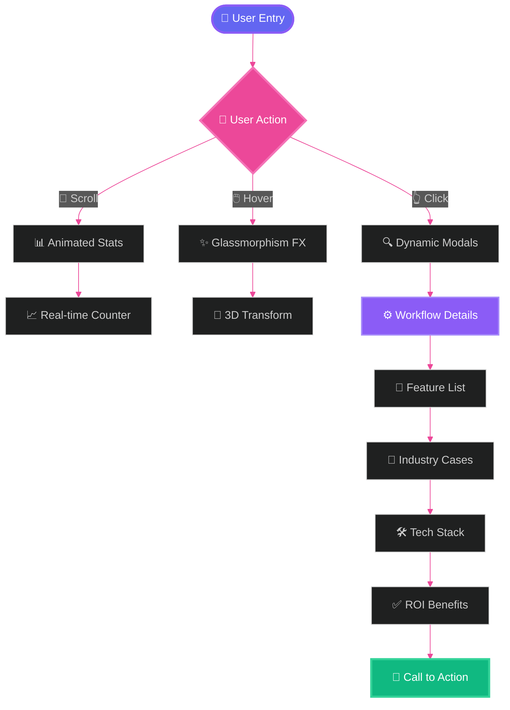

<div align="center">

<!-- ═══════════════════════════════════════════════════════════════════════════════ -->
<!-- 🌟 ANIMATED HERO BANNER -->
<!-- ═══════════════════════════════════════════════════════════════════════════════ -->


<!-- ═══════════════════════════════════════════════════════════════════════════════ -->
<!-- 🎯 ANIMATED TYPING EFFECT -->
<!-- ═══════════════════════════════════════════════════════════════════════════════ -->

<a href="https://git.io/typing-svg">
  
</a>

<!-- ═══════════════════════════════════════════════════════════════════════════════ -->
<!-- 🏆 BADGES & METRICS -->
<!-- ═══════════════════════════════════════════════════════════════════════════════ -->

<p>
  
  
  
  
</p>

<p>
  
  
  
  
  
</p>

<!-- ═══════════════════════════════════════════════════════════════════════════════ -->
<!-- 🎨 ANIMATED DIVIDER -->
<!-- ═══════════════════════════════════════════════════════════════════════════════ -->


<!-- ═══════════════════════════════════════════════════════════════════════════════ -->
<!-- 🌐 LIVE DEMO SHOWCASE - STUNNING PRESENTATION -->
<!-- ═══════════════════════════════════════════════════════════════════════════════ -->

## 🌐 **LIVE DEMO** - *Experience The Magic*

<div align="center">
  
<table>
<tr>
<td align="center" width="100%">

### 🎯 **Click Below To Enter The Future of Automation** 🎯

<a href="https://moh222salah.github.io/automation-workflows/" target="_blank">
  
</a>

<br/><br/>

<a href="https://moh222salah.github.io/automation-workflows/" target="_blank">
  
</a>

<br/>

```
┌─────────────────────────────────────────────────────────────┐
│                                                             │
│  🔗  https://moh222salah.github.io/automation-workflows/   │
│                                                             │
│  ✨ Lightning Fast  |  🎨 Stunning Design  |  🚀 AI-Powered │
│                                                             │
└─────────────────────────────────────────────────────────────┘
```

<p align="center">
  
</p>

### 📊 **Real-Time Stats Dashboard**

<table>
<tr>
<td align="center">

</td>
<td align="center">

</td>
<td align="center">

</td>
</tr>
</table>

</td>
</tr>
</table>

</div>

<!-- ═══════════════════════════════════════════════════════════════════════════════ -->
<!-- 🎬 PROJECT PREVIEW -->
<!-- ═══════════════════════════════════════════════════════════════════════════════ -->

<br/>

<details>
<summary>🎬 <b>CLICK TO SEE PREVIEW SCREENSHOTS</b> 🎬</summary>
<br/>

<div align="center">

### 🖥️ **Desktop Experience**


### 📱 **Mobile Experience**


</div>

</details>


</div>

<br/><br/>

<!-- ═══════════════════════════════════════════════════════════════════════════════ -->
<!-- 🎯 PROJECT VISION -->
<!-- ═══════════════════════════════════════════════════════════════════════════════ -->

<div align="center">

## 🌌 **PROJECT VISION**


</div>

```ascii
╔═══════════════════════════════════════════════════════════════════════════╗
║                                                                           ║
║   The AI Workflow Automation Hub is an enterprise-grade showcase that    ║
║   demonstrates the perfect fusion of:                                    ║
║                                                                           ║
║   🎨 Glassmorphism Design  +  ⚡ High-Performance Code                   ║
║   🤖 AI Intelligence       +  🚀 Zero Dependencies                       ║
║   💎 Premium UX            +  📱 100% Responsive                         ║
║                                                                           ║
╚═══════════════════════════════════════════════════════════════════════════╝
```

> [!IMPORTANT]
> **🔥 Performance First Philosophy**
> 
> This project is built with **ZERO external dependencies**. No heavy frameworks, no bloated libraries—just pure, optimized **Vanilla JavaScript**, **HTML5**, and **CSS3** delivering exceptional performance.

<br/>

<!-- ═══════════════════════════════════════════════════════════════════════════════ -->
<!-- 🛠️ TECHNOLOGY STACK -->
<!-- ═══════════════════════════════════════════════════════════════════════════════ -->

<div align="center">

## 🛠️ **TECHNOLOGY STACK & AUTOMATION GEARS**


</div>

<table align="center">
<tr>
<th>🎨 Frontend Core</th>
<th>⚡ Logic & Motion</th>
<th>🤖 Automation Stack</th>
</tr>
<tr>
<td>

```yaml
HTML5:
  - Semantic Structure
  - SEO Optimized
  - Accessibility (A11y)

CSS3:
  - Glassmorphism
  - Custom Properties
  - Grid & Flexbox
  - Animations

JavaScript ES6+:
  - Pure Vanilla JS
  - No Dependencies
  - Event-Driven
```

</td>
<td>

```yaml
Intersection Observer:
  - Scroll Animations
  - Lazy Loading
  - Performance

Particle System:
  - Canvas Animation
  - 60 FPS Target
  
Performance:
  - Lighthouse 95+
  - < 100KB Bundle
  - < 2s Load Time
```

</td>
<td>

```yaml
n8n:
  - Workflow Engine
  - 400+ Integrations

OpenAI:
  - GPT-4 API
  - Intelligent Processing

Docker:
  - Containerization
  - Scalability

PostgreSQL:
  - Data Storage
  - Reliability
```

</td>
</tr>
</table>

<div align="center">

### 🏆 **Technology Badges**

<p>

</p>


</div>

<br/>

<!-- ═══════════════════════════════════════════════════════════════════════════════ -->
<!-- 🏗️ ARCHITECTURE -->
<!-- ═══════════════════════════════════════════════════════════════════════════════ -->

<div align="center">

## 🏗️ **ARCHITECTURE & FLOW**


</div>



<br/>

<!-- ═══════════════════════════════════════════════════════════════════════════════ -->
<!-- 📂 PROJECT STRUCTURE -->
<!-- ═══════════════════════════════════════════════════════════════════════════════ -->

<div align="center">

## 📂 **PROJECT STRUCTURE**

</div>

```ascii
ai-workflow-hub/
│
├── 📄 index.html          ← Main HTML structure with semantic markup
├── 🎨 styles.css          ← Comprehensive styling with glassmorphism
├── ⚡ script.js           ← Interactive functionality and animations
├── 📖 README.md           ← This amazing file you're reading
└── 🚀 .github/            ← GitHub Actions & workflows
```

<details>
<summary>🗂️ <b>DETAILED FILE BREAKDOWN</b></summary>
<br/>

<table align="center" width="100%">
<tr>
<th width="30%">File</th>
<th width="70%">Description</th>
</tr>
<tr>
<td><code>index.html</code></td>
<td>
  • Semantic HTML5 structure<br/>
  • SEO optimized meta tags<br/>
  • Accessibility features<br/>
  • Open Graph for social sharing
</td>
</tr>
<tr>
<td><code>styles.css</code></td>
<td>
  • Glassmorphism effects<br/>
  • CSS custom properties<br/>
  • Responsive design system<br/>
  • Smooth animations
</td>
</tr>
<tr>
<td><code>script.js</code></td>
<td>
  • Pure Vanilla JavaScript<br/>
  • Intersection Observer API<br/>
  • Dynamic modal system<br/>
  • Particle animation engine
</td>
</tr>
</table>

</details>

<br/>

<!-- ═══════════════════════════════════════════════════════════════════════════════ -->
<!-- 🎨 DESIGN SYSTEM -->
<!-- ═══════════════════════════════════════════════════════════════════════════════ -->

<div align="center">

## 🎨 **DESIGN SYSTEM**


</div>

<table align="center">
<tr>
<td align="center" width="33%">

### 🌈 **Color Palette**


**Primary**: `#6366f1`


**Secondary**: `#ec4899`


**Accent**: `#8b5cf6`

</td>
<td align="center" width="33%">

### 📐 **Typography**

```css
Font Family:
  -apple-system
  BlinkMacSystemFont
  'Segoe UI'
  Roboto
  
Weights:
  Regular: 400
  Medium:  600
  Bold:    800
  
Sizes:
  H1: 3.5rem
  H2: 2.5rem
  Body: 1rem
```

</td>
<td align="center" width="33%">

### 📏 **Spacing Scale**

```yaml
XS:  0.5rem  (8px)
SM:  1rem    (16px)
MD:  2rem    (32px)
LG:  4rem    (64px)
XL:  6rem    (96px)

Border Radius:
  SM: 0.5rem
  MD: 1rem
  LG: 1.5rem
  XL: 2rem
```

</td>
</tr>
</table>

<br/>

<!-- ═══════════════════════════════════════════════════════════════════════════════ -->
<!-- ⚡ FEATURES -->
<!-- ═══════════════════════════════════════════════════════════════════════════════ -->

<div align="center">

## ⚡ **STUNNING FEATURES**


</div>

<table align="center">
<tr>
<td width="50%">

### 🎭 **Interactive Elements**

```javascript
✨ Animated Statistics Counter
   └─ Numbers count up on scroll

💫 Parallax Particles
   └─ Floating animated background

🔮 Glassmorphism Cards
   └─ Frosted glass with blur

🎯 Hover Transformations
   └─ Cards lift and glow

🌊 Smooth Scroll Navigation
   └─ Anchored smooth scrolling

👁️ Intersection Observer
   └─ Elements fade in on view

🎬 Dynamic Modals
   └─ Full-screen workflow details
```

</td>
<td width="50%">

### 📊 **Performance Metrics**

```yaml
Load Times:
  First Paint:     < 1.5s
  Interactive:     < 2.5s
  Bundle Size:     < 100KB

Lighthouse Scores:
  Performance:     95+ 🟢
  Accessibility:   100 🟢
  Best Practices:  100 🟢
  SEO:             100 🟢

Optimization:
  ✅ Minified CSS/JS
  ✅ Optimized images
  ✅ Lazy loading
  ✅ Efficient DOM
  ✅ CSS animations
```

</td>
</tr>
</table>

<br/>

<!-- ═══════════════════════════════════════════════════════════════════════════════ -->
<!-- 🚀 WORKFLOW SOLUTIONS -->
<!-- ═══════════════════════════════════════════════════════════════════════════════ -->

<div align="center">

## 🚀 **10 POWERFUL AUTOMATION WORKFLOWS**


</div>

<table>
<tr>
<td width="5%">1️⃣</td>
<td width="30%"><b>Lead Qualification & Distribution</b></td>
<td width="65%">AI-powered lead scoring with smart CRM routing | <code>85% faster response</code></td>
</tr>
<tr>
<td>2️⃣</td>
<td><b>AI Document Processing</b></td>
<td>OCR + NLP for 99%+ accurate data extraction | <code>90% faster processing</code></td>
</tr>
<tr>
<td>3️⃣</td>
<td><b>Decision Logic & Routing</b></td>
<td>Complex conditional routing with AI patterns | <code>95% fewer errors</code></td>
</tr>
<tr>
<td>4️⃣</td>
<td><b>Real-time Notifications</b></td>
<td>Multi-channel alerts (Email/SMS/Slack) | <code>99.9% delivery rate</code></td>
</tr>
<tr>
<td>5️⃣</td>
<td><b>E-commerce Order Automation</b></td>
<td>End-to-end order processing & fulfillment | <code>10x faster</code></td>
</tr>
<tr>
<td>6️⃣</td>
<td><b>Customer Support Automation</b></td>
<td>AI chatbot with intelligent ticket routing | <code>60% auto-resolution</code></td>
</tr>
<tr>
<td>7️⃣</td>
<td><b>Data Sync & Migration</b></td>
<td>Bi-directional real-time synchronization | <code>99% sync accuracy</code></td>
</tr>
<tr>
<td>8️⃣</td>
<td><b>Social Media Management</b></td>
<td>Cross-platform scheduling & analytics | <code>15+ hours saved weekly</code></td>
</tr>
<tr>
<td>9️⃣</td>
<td><b>Financial Reconciliation</b></td>
<td>Automated invoice matching & fraud detection | <code>90% faster</code></td>
</tr>
<tr>
<td>🔟</td>
<td><b>HR Onboarding Automation</b></td>
<td>Complete employee onboarding workflow | <code>70% faster onboarding</code></td>
</tr>
</table>

<div align="center">

### 💎 **Each Workflow Includes**

<table>
<tr>
<td align="center">📋<br/><b>Detailed<br/>Description</b></td>
<td align="center">🌟<br/><b>Key<br/>Features</b></td>
<td align="center">📊<br/><b>Process<br/>Diagram</b></td>
<td align="center">💼<br/><b>Industry<br/>Use Cases</b></td>
<td align="center">🛠️<br/><b>Tech<br/>Stack</b></td>
<td align="center">✅<br/><b>Measurable<br/>ROI</b></td>
</tr>
</table>

</div>

<br/>

<!-- ═══════════════════════════════════════════════════════════════════════════════ -->
<!-- 🚀 GETTING STARTED -->
<!-- ═══════════════════════════════════════════════════════════════════════════════ -->

<div align="center">

## 🚀 **GETTING STARTED**


</div>

### 📋 **Prerequisites**

```yaml
Required:
  - Modern web browser (Chrome 90+, Firefox 88+, Safari 14+, Edge 90+)
  
Optional:
  - Local web server for development
  - Text editor (VS Code recommended)
```

### 💻 **Installation Methods**

<table>
<tr>
<td width="50%">

#### Method 1: Direct Download

```bash
# Download ZIP file
# Extract to your desired location
# Open index.html in browser
```

#### Method 2: Git Clone

```bash
git clone https://github.com/yourusername/ai-workflow-hub.git
cd ai-workflow-hub
# Open index.html
```

</td>
<td width="50%">

#### Method 3: Local Server

```bash
# Python 3
python -m http.server 8000

# Node.js
npx http-server

# PHP
php -S localhost:8000

# Then visit:
# http://localhost:8000
```

</td>
</tr>
</table>

<div align="center">

### ⚡ **Quick Start**

```
1️⃣ Download or clone the repository
2️⃣ Open index.html in your browser
3️⃣ Explore the 10 automation workflows
4️⃣ Click cards to view detailed information
5️⃣ Enjoy the stunning animations! ✨
```

</div>

<br/>

<!-- ═══════════════════════════════════════════════════════════════════════════════ -->
<!-- 📱 RESPONSIVE DESIGN -->
<!-- ═══════════════════════════════════════════════════════════════════════════════ -->

<div align="center">

## 📱 **100% RESPONSIVE DESIGN**

</div>

<table align="center">
<tr>
<th>📱 Device</th>
<th>📏 Breakpoint</th>
<th>🎨 Optimizations</th>
</tr>
<tr>
<td align="center">

**Mobile**


</td>
<td align="center">

`< 480px`

</td>
<td>

• Single column layout
• Stacked navigation  
• Touch-optimized buttons
• Reduced animations

</td>
</tr>
<tr>
<td align="center">

**Tablet**


</td>
<td align="center">

`481px - 768px`

</td>
<td>

• Two-column grids
• Adjusted spacing
• Medium-sized touch targets
• Optimized images

</td>
</tr>
<tr>
<td align="center">

**Desktop**


</td>
<td align="center">

`769px - 1200px`

</td>
<td>

• Full multi-column layout
• Hover effects enabled
• Advanced animations
• Parallax effects

</td>
</tr>
<tr>
<td align="center">

**Large Desktop**


</td>
<td align="center">

`> 1200px`

</td>
<td>

• Maximum container (1200px)
• Enhanced glassmorphism
• Full feature set
• Premium experience

</td>
</tr>
</table>

<br/>

<!-- ═══════════════════════════════════════════════════════════════════════════════ -->
<!-- 🎓 CUSTOMIZATION GUIDE -->
<!-- ═══════════════════════════════════════════════════════════════════════════════ -->

<div align="center">

## 🎓 **CUSTOMIZATION GUIDE**


</div>

<table>
<tr>
<td width="50%">

### 🎨 **Change Colors**

```css
/* Edit in styles.css */
:root {
    --primary-color: #6366f1;
    --secondary-color: #ec4899;
    --accent-color: #8b5cf6;
    
    /* Change to your brand colors */
    --primary-color: #YOUR_COLOR;
}
```

### ⚡ **Modify Animations**

```css
/* Adjust animation speeds */
:root {
    --transition-fast: 0.2s ease;
    --transition-normal: 0.3s ease;
    --transition-slow: 0.5s ease;
}
```

</td>
<td width="50%">

### ➕ **Add New Workflows**

```javascript
// In script.js
workflowDetails[11] = {
    title: "Your Workflow",
    icon: "🚀",
    gradient: "linear-gradient(...)",
    description: "...",
    features: [...],
    workflow: [...],
    useCases: [...],
    technologies: [...],
    benefits: [...]
};
```

</td>
</tr>
</table>

<br/>

<!-- ═══════════════════════════════════════════════════════════════════════════════ -->
<!-- 🌐 BROWSER SUPPORT -->
<!-- ═══════════════════════════════════════════════════════════════════════════════ -->

<div align="center">

## 🌐 **BROWSER SUPPORT**

<p>


</p>

</div>

<br/>

<!-- ═══════════════════════════════════════════════════════════════════════════════ -->
<!-- 📞 CONTACT -->
<!-- ═══════════════════════════════════════════════════════════════════════════════ -->

<div align="center">

## 📞 **LET'S BUILD SOMETHING AMAZING TOGETHER**


<br/><br/>

<table>
<tr>
<td align="center" width="33%">

### 💼 **Portfolio**

<a href="https://moh222salah.github.io/cv" target="_blank">
  
</a>

</td>
<td align="center" width="33%">

### 💬 **WhatsApp**

<a href="https://wa.me/201113903070" target="_blank">
  
</a>

</td>
<td align="center" width="33%">

### 🌍 **Location**


</td>
</tr>
</table>

<br/>

```
╔═══════════════════════════════════════════════════════════════════════════╗
║                                                                           ║
║   🌟 Serving clients across Egypt, Gulf Countries, and internationally   ║
║   🚀 Delivering cutting-edge automation solutions                        ║
║   💎 Transforming businesses with AI-powered workflows                   ║
║                                                                           ║
╚═══════════════════════════════════════════════════════════════════════════╝
```

</div>

<br/>

<!-- ═══════════════════════════════════════════════════════════════════════════════ -->
<!-- 📄 LICENSE -->
<!-- ═══════════════════════════════════════════════════════════════════════════════ -->

<div align="center">

## 📄 **LICENSE**


</div>

```
MIT License

Copyright (c) 2024 AI Workflow Hub

Permission is hereby granted, free of charge, to any person obtaining a copy
of this software and associated documentation files (the "Software"), to deal
in the Software without restriction, including without limitation the rights
to use, copy, modify, merge, publish, distribute, sublicense, and/or sell
copies of the Software, and to permit persons to whom the Software is
furnished to do so, subject to the following conditions:

The above copyright notice and this permission notice shall be included in all
copies or substantial portions of the Software.
```

<br/>

<!-- ═══════════════════════════════════════════════════════════════════════════════ -->
<!-- 🙏 ACKNOWLEDGMENTS -->
<!-- ═══════════════════════════════════════════════════════════════════════════════ -->

<div align="center">

## 🙏 **ACKNOWLEDGMENTS**

<table>
<tr>
<td align="center" width="33%">

### 🎨 **Design**

Modern glassmorphism trends  
Apple's design language  
Dribbble inspiration

</td>
<td align="center" width="33%">

### ⚙️ **Automation**

Industry best practices  
Real-world implementations  
n8n community

</td>
<td align="center" width="33%">

### 🌐 **Community**

Open-source contributors  
Workflow automation enthusiasts  
GitHub community

</td>
</tr>
</table>

</div>

<br/>

<!-- ═══════════════════════════════════════════════════════════════════════════════ -->
<!-- 📊 PROJECT STATS -->
<!-- ═══════════════════════════════════════════════════════════════════════════════ -->

<div align="center">

## 📊 **PROJECT STATISTICS**


<br/>


<br/>

<p>


</p>

</div>

<br/>

<!-- ═══════════════════════════════════════════════════════════════════════════════ -->
<!-- 🌟 SUPPORT & STAR -->
<!-- ═══════════════════════════════════════════════════════════════════════════════ -->

<div align="center">

## 🌟 **SHOW YOUR SUPPORT**


<br/><br/>

<a href="https://github.com/moh222salah/automation-workflows">
  
</a>
<a href="https://github.com/moh222salah/automation-workflows/fork">
  
</a>
<a href="https://github.com/moh222salah/automation-workflows/watchers">
  
</a>

<br/><br/>

```
╔═══════════════════════════════════════════════════════════════════════════╗
║                                                                           ║
║                   ⭐ Star this repo on GitHub! ⭐                         ║
║                                                                           ║
║   Your support means the world and motivates continued development 💖    ║
║                                                                           ║
╚═══════════════════════════════════════════════════════════════════════════╝
```

</div>

<br/><br/>

<!-- ═══════════════════════════════════════════════════════════════════════════════ -->
<!-- 🎬 FOOTER -->
<!-- ═══════════════════════════════════════════════════════════════════════════════ -->

<div align="center">


<br/>


<br/><br/>

<p>

</p>

<br/>

### **Built with ❤️ and ⚡ for the automation community**

<br/>

**© 2024 AI Workflow Hub. All rights reserved.**

<br/>


</div>
