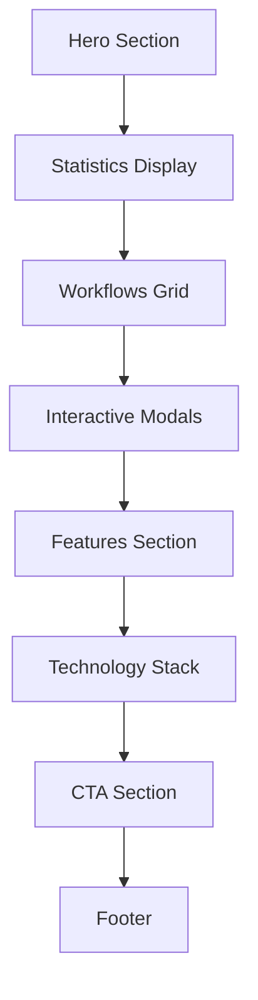

# ⚡ AI Workflow Automation Hub

<div align="center">


**Transform Your Business with Intelligent Workflow Automation**

*A cutting-edge single-page application showcasing the top 10 most demanded workflow automation solutions powered by AI and modern technologies*

[🚀 Live Demo](#) • [📖 Documentation](#features) • [💬 Contact](#contact)

---

</div>


# <p align="center">⚡ AI Workflow Automation Hub ⚡</p>

<div align="center">


[](https://github.com/moh222salah/automation-workflows)
[](https://opensource.org/licenses/MIT)
[](https://github.com/moh222salah/automation-workflows)
[](https://github.com/moh222salah/automation-workflows)

### 🚀 "Transform Your Business with Intelligent Workflow Automation"
*A premium single-page application showcasing the peak of AI-powered automation.*

[🌐 Live Demo](#) • [📝 Documentation](#) • [✉️ Contact Developer](https://wa.me/201113903070)

---
</div>

## 🌌 Project Vision
The **AI Workflow Automation Hub** is an enterprise-grade showcase platform. It's not just a website; it's a demonstration of how **Glassmorphism Design** meets **High-Performance Automation**.

> [!IMPORTANT]
> **Performance First:** This project is built with **ZERO dependencies**. No heavy frameworks, just pure, optimized Vanilla JS, HTML5, and CSS3.

---

## 🛠️ Technology Stack & Automation Gears

<div align="center">

| Core Frontend | Logic & Motion | Automation (Showcased) |
| :--- | :--- | :--- |
|  |  |  |
|  |  |  |
|  |  |  |

</div>

---

## 🏗️ Architecture & Flow

```mermaid
graph LR
    A[User Entry] --> B{Interaction}
    B -->|Scroll| C[Animated Stats]
    B -->|Hover| D[Glassmorphism FX]
    B -->|Click| E[Dynamic Modals]
    E --> F[Workflow Analysis]
    style A fill:#6366f1,stroke:#fff,stroke-width:2px,color:#fff
    style F fill:#ec4899,stroke:#fff,stroke-width:2px,color:#fff


###################################


---

## 🏗️ Architecture & Structure

```
ai-workflow-hub/
│
├── index.html          # Main HTML structure
├── styles.css          # Comprehensive styling with glassmorphism
├── script.js           # Interactive functionality and animations
└── README.md           # This file
```

### 📋 Page Sections



---

## 🎨 Design System

### Color Palette

```css
Primary Colors:
  - Primary: #6366f1 (Indigo)
  - Secondary: #ec4899 (Pink)
  - Accent: #8b5cf6 (Purple)

Background:
  - Primary: #0a0a0f (Deep Black)
  - Secondary: #13131a (Dark Gray)
  - Glass: rgba(255, 255, 255, 0.08)

Text:
  - Primary: #ffffff (White)
  - Secondary: #a1a1aa (Light Gray)
```

### Typography

- **Font Family**: System fonts (Apple, Segoe UI, Roboto)
- **Headings**: 800 weight, responsive sizing with `clamp()`
- **Body**: 400-600 weight, 1.6 line height for readability

### Spacing System

- **XS**: 0.5rem (8px)
- **SM**: 1rem (16px)
- **MD**: 2rem (32px)
- **LG**: 4rem (64px)
- **XL**: 6rem (96px)

---

## 🛠️ Technologies Used

<div align="center">

### Core Technologies

| Technology | Purpose | Version |
|------------|---------|---------|
|  | Structure | HTML5 |
|  | Styling | CSS3 |
|  | Functionality | ES6+ |

### Automation Stack (Showcased)


</div>

---

## 🚀 Getting Started

### Prerequisites

- Modern web browser (Chrome 90+, Firefox 88+, Safari 14+, Edge 90+)
- Basic web server (optional, for local development)

### Installation

1. **Clone or Download**
   ```bash
   # Clone the repository (if using Git)
   git clone https://github.com/yourusername/ai-workflow-hub.git
   
   # Or download the ZIP and extract
   ```

2. **Open in Browser**
   ```bash
   # Simply open index.html in your browser
   # Or use a local server:
   
   # Python 3
   python -m http.server 8000
   
   # Node.js (http-server)
   npx http-server
   
   # PHP
   php -S localhost:8000
   ```

3. **Access**
   ```
   http://localhost:8000
   ```

### Quick Start

No build process required! Just open `index.html` in your browser and explore.

---

## 📱 Responsive Breakpoints

| Device | Breakpoint | Optimizations |
|--------|------------|---------------|
| **Mobile** | < 480px | Single column layout, stacked navigation |
| **Tablet** | 481px - 768px | Two-column grids, adjusted spacing |
| **Desktop** | 769px - 1200px | Full multi-column layout |
| **Large Desktop** | > 1200px | Maximum width container (1200px) |

---

## ✨ Features in Detail

### 🎭 Interactive Elements

- **Animated Statistics Counter** - Numbers count up on scroll into view
- **Parallax Particles** - Floating animated particles in background
- **Glassmorphism Cards** - Frosted glass effect with blur and transparency
- **Hover Transformations** - Cards lift and glow on hover
- **Smooth Scroll Navigation** - Anchored navigation with smooth scrolling
- **Intersection Observer** - Elements fade in as they enter viewport
- **Dynamic Modals** - Full-screen workflow details with rich content

### 🎨 Workflow Modal System

Each workflow has a dedicated modal featuring:

- **Comprehensive Description** - Detailed explanation of the workflow
- **Key Features** - 6+ major capabilities and functionalities
- **Workflow Diagram** - Step-by-step process visualization
- **Industry Use Cases** - 4+ real-world application scenarios
- **Technology Stack** - Technologies and tools used
- **Measurable Benefits** - Quantified ROI and performance improvements

### 📊 Statistics Dashboard

Real-time animated counters showing:
- **500+** Projects Automated
- **95%** Success Rate
- **80%** Time Saved

---

## 🎯 Workflow Automation Solutions

### 1️⃣ Lead Qualification & Distribution
**Automate lead scoring and intelligent routing to sales teams**

- AI-powered lead scoring (0-100 scale)
- Smart distribution based on expertise and workload
- CRM integration (Salesforce, HubSpot, Pipedrive)
- Real-time notifications to assigned reps
- Data enrichment from multiple sources

**ROI**: 85% faster response time, 40% higher conversion rates

---

### 2️⃣ AI Document Processing & Analysis
**Extract and analyze documents with OCR and NLP**

- 99%+ accurate OCR text extraction
- Automatic document classification
- Intelligent data field extraction
- Multi-language support (50+ languages)
- Integration with accounting and ERP systems

**ROI**: 90% faster processing, eliminate 95% of manual data entry

---

### 3️⃣ Decision Logic & Smart Routing
**Complex conditional routing with AI pattern matching**

- Advanced rule engine with nested logic
- AI-powered pattern recognition
- Dynamic priority assignment
- Load balancing across teams
- Automatic escalation management

**ROI**: 95% fewer routing errors, 60% faster response times

---

### 4️⃣ Real-time Notifications System
**Multi-channel instant alerts and notifications**

- Email, SMS, Slack, Teams, WhatsApp support
- Smart scheduling respecting user preferences
- Priority-based channel selection
- Template management with personalization
- Delivery tracking and retry logic

**ROI**: 99.9% delivery rate, sub-second notifications

---

### 5️⃣ E-commerce Order Automation
**End-to-end order processing and fulfillment**

- Automatic order processing and validation
- Real-time inventory synchronization
- Shipping label generation and carrier selection
- Multi-channel integration (Shopify, Amazon, eBay)
- Returns processing automation

**ROI**: 10x faster processing, 95% fewer fulfillment errors

---

### 6️⃣ Customer Support Automation
**AI-powered support with intelligent routing**

- AI chatbot for instant responses
- Automatic ticket categorization and routing
- Sentiment analysis for priority handling
- Knowledge base integration
- SLA monitoring and compliance

**ROI**: 60% auto-resolution rate, 75% faster first response

---

### 7️⃣ Data Sync & Migration System
**Robust bi-directional data synchronization**

- Real-time or scheduled synchronization
- Intelligent conflict resolution
- Data transformation and validation
- Incremental updates for efficiency
- Rollback capability for safety

**ROI**: 99% sync accuracy, eliminate manual data entry

---

### 8️⃣ Social Media Management
**Cross-platform social media automation**

- Multi-platform scheduling and posting
- AI content curation and suggestions
- Engagement monitoring and auto-responses
- Unified analytics dashboard
- Competitor analysis and tracking

**ROI**: Save 15+ hours weekly, 300% more consistent posting

---

### 9️⃣ Financial Reconciliation
**Automated invoice matching and fraud detection**

- Intelligent invoice-to-payment matching
- Multi-channel payment tracking
- Anomaly and fraud detection
- Accounts receivable aging reports
- Multi-currency support

**ROI**: 90% faster reconciliation, 99.9% accuracy

---

### 🔟 HR Onboarding Automation
**Complete employee onboarding workflow**

- Digital document collection and verification
- Automatic account provisioning
- Training assignment and tracking
- Equipment ordering automation
- Compliance tracking and reporting

**ROI**: 70% faster onboarding, 100% compliance

---

## 🎨 Customization Guide

### Changing Colors

Edit the CSS variables in `styles.css`:

```css
:root {
    --primary-color: #6366f1;      /* Change primary color */
    --secondary-color: #ec4899;    /* Change secondary color */
    --accent-color: #8b5cf6;       /* Change accent color */
}
```

### Adding New Workflows

1. **Add HTML Card** in `index.html`:
```html
<div class="workflow-card" data-workflow="11">
    <!-- Card content -->
</div>
```

2. **Add Workflow Details** in `script.js`:
```javascript
workflowDetails[11] = {
    title: "Your Workflow Title",
    icon: "🚀",
    gradient: "linear-gradient(135deg, #color1, #color2)",
    description: "Detailed description...",
    // ... other properties
};
```

### Modifying Animations

Adjust animation speeds in `styles.css`:

```css
--transition-fast: 0.2s ease;      /* Quick transitions */
--transition-normal: 0.3s ease;    /* Standard transitions */
--transition-slow: 0.5s ease;      /* Slow transitions */
```

---

## 📈 Performance Metrics

### Load Times
- **First Contentful Paint**: < 1.5s
- **Time to Interactive**: < 2.5s
- **Total Bundle Size**: < 100KB (uncompressed)

### Optimization Techniques
- ✅ Minified CSS and JavaScript
- ✅ Optimized images and icons
- ✅ Lazy loading for modals
- ✅ Efficient DOM manipulation
- ✅ CSS animations over JavaScript
- ✅ Intersection Observer for scroll effects

### Lighthouse Scores (Target)
- 🟢 **Performance**: 95+
- 🟢 **Accessibility**: 100
- 🟢 **Best Practices**: 100
- 🟢 **SEO**: 100

---

## 🌐 Browser Support

| Browser | Version | Support |
|---------|---------|---------|
| Chrome | 90+ | ✅ Full Support |
| Firefox | 88+ | ✅ Full Support |
| Safari | 14+ | ✅ Full Support |
| Edge | 90+ | ✅ Full Support |
| Opera | 76+ | ✅ Full Support |

### Required Features
- CSS Grid & Flexbox
- CSS Custom Properties
- Intersection Observer API
- ES6+ JavaScript
- Backdrop Filter (for glassmorphism)

---

## 📚 Code Structure

### HTML Organization
```
index.html
├── Navigation Bar
├── Hero Section
│   ├── Title & Description
│   ├── Statistics Counter
│   └── CTA Buttons
├── Workflows Section
│   └── 10 Workflow Cards
├── Features Section
├── Technology Stack
├── CTA Section
└── Footer
```

### CSS Architecture
```
styles.css
├── Reset & Base Styles
├── CSS Custom Properties
├── Background & Particles
├── Navigation
├── Hero Section
├── Workflow Cards
├── Modal System
├── Features & Tech Grid
├── Footer
├── Responsive Breakpoints
└── Animations & Utilities
```

### JavaScript Modules
```
script.js
├── Initialization
├── Navbar Scroll Effects
├── Particle Animation System
├── Scroll Animations (Intersection Observer)
├── Statistics Counter
├── Workflow Modal System
├── Mobile Menu Handler
└── Smooth Scroll Navigation
```

---

## 🔧 Advanced Features

### Intersection Observer Implementation

```javascript
const observer = new IntersectionObserver((entries) => {
    entries.forEach(entry => {
        if (entry.isIntersecting) {
            // Trigger animation when element enters viewport
            entry.target.style.opacity = '1';
            entry.target.style.transform = 'translateY(0)';
        }
    });
}, { threshold: 0.1 });
```

### Dynamic Particle System

```javascript
function initParticles() {
    const particleCount = 50;
    for (let i = 0; i < particleCount; i++) {
        // Create floating particles with random properties
        // Animate using CSS keyframes for performance
    }
}
```

### Modal State Management

```javascript
function toggleWorkflowDetails(id) {
    const modal = document.getElementById(`modal-${id}`);
    modal.classList.add('active');
    document.body.style.overflow = 'hidden';
}
```

---

## 🎓 Learning Resources

### Technologies Used in Automation
- **n8n**: [Documentation](https://docs.n8n.io/)
- **OpenAI API**: [API Reference](https://platform.openai.com/docs/)
- **Workflow Automation**: Best practices and patterns

### Web Development
- **CSS Glassmorphism**: [Guide](https://css.glass/)
- **Intersection Observer**: [MDN Docs](https://developer.mozilla.org/en-US/docs/Web/API/Intersection_Observer_API)
- **Responsive Design**: Modern techniques and frameworks

---

## 📞 Contact

<div align="center">

### Ready to Transform Your Business?

[](https://moh222salah.github.io/cv)
[](https://wa.me/201113903070)

**Expert Full-Stack Developer | Workflow Automation Specialist**

Serving clients across Egypt, Gulf Countries, and internationally with cutting-edge automation solutions.

</div>

---

## 📄 License

This project is licensed under the MIT License - see below for details:

```
MIT License

Copyright (c) 2024 AI Workflow Hub

Permission is hereby granted, free of charge, to any person obtaining a copy
of this software and associated documentation files (the "Software"), to deal
in the Software without restriction, including without limitation the rights
to use, copy, modify, merge, publish, distribute, sublicense, and/or sell
copies of the Software, and to permit persons to whom the Software is
furnished to do so, subject to the following conditions:

The above copyright notice and this permission notice shall be included in all
copies or substantial portions of the Software.
```

---

## 🙏 Acknowledgments

- **Design Inspiration**: Modern glassmorphism trends and Apple's design language
- **Automation Patterns**: Industry best practices and real-world implementations
- **Community**: Open-source contributors and workflow automation enthusiasts

---

## 📊 Project Stats

<div align="center">


**Built with ❤️ and ⚡ for the automation community**

⭐ Star this project if you find it useful!

</div>

---

<div align="center">

### 🚀 Transform Your Workflow Today

*Precision • Innovation • Excellence*

**© 2024 AI Workflow Hub. All rights reserved.**

</div>
